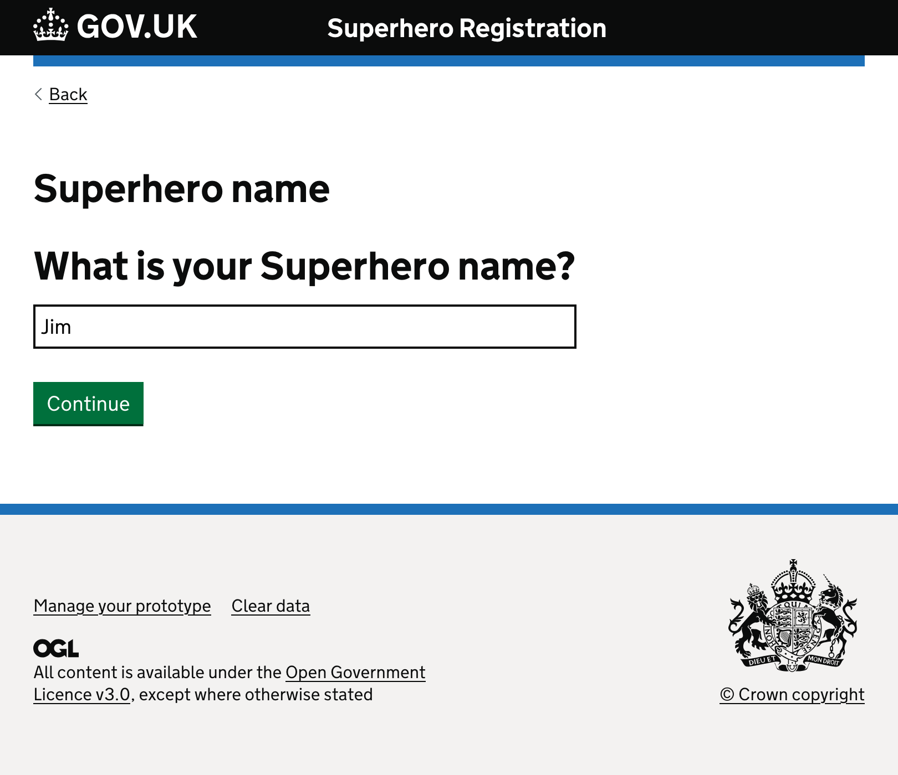

#   🦸🏻 Superhero Licence
## GOV.UK prototyping kit

I wanted to try out the GOV.UK Protype Kit. So I followed their basic tutorial and created this little example of a form flow using components from the [GOV.UK design system](https://design-system.service.gov.uk/).
It's fairly straightforward to follow along. You just need to have Node.js installed and run it from your Terminal.

### Instructions to run:
Once you've cloned/downloaded my folder, you just have to navigate to it in your Terminal. e.g.
`cd ~/Documents/prototypes/superhero-licence`

Then in the Terminal, enter:
`npm run dev`

In your web browser, view the prototype by going to:
http://localhost:3000/ 

To quit the prototype kit:
Press `ctrl` and `c` keys together in the terminal.

---

### Prototype
Try out making the basic gov.uk prototype yourself.
https://prototype-kit.service.gov.uk/docs/create-new-prototype 

I found that it's a good introduction to:
- Using the Terminal
- Using VS Code
- Basic HTML
- Creating and linking different pages together
- Using components from the gov.uk design system
- Prototyping that allows users to see and reflect upon the data they've input from other pages
- Branching logic: showing the user a page that stops the flow if the service is not relevant to them

---
